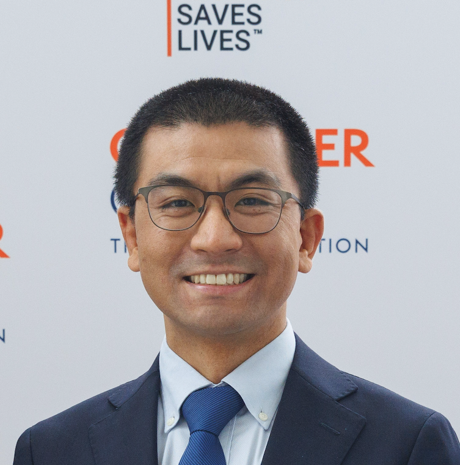

## People

### S. John Liu MD PhD

Chief Resident  
Holman Pathway Research Fellow  
Department of Radiation Oncology  
Department of Neurological Surgery  
University of California, San Francisco  

Dr. John Liu received his bachelor’s degree from Harvard University in Chemical and Physical Biology. He completed his MD and PhD training at the University of California, San Francisco, under joint mentorship with Daniel Lim and Jonathan Weissman. He continued onto residency in Radiation Oncology at UCSF and pursued postdoctoral research with Luke Gilbert, David Raleigh, and Bill Weiss. He currently operates a research program under the directorship of Mitchel Berger within the UCSF Brain Tumor Center, with a research focus on utilizing epigenomic editing for understanding and overcoming treatment resistance in malignant glioma. When not conducting research, John enjoys spending time with his wife and daughter and is frequently seen cycling in the early mornings around the San Francisco Bay Area.

