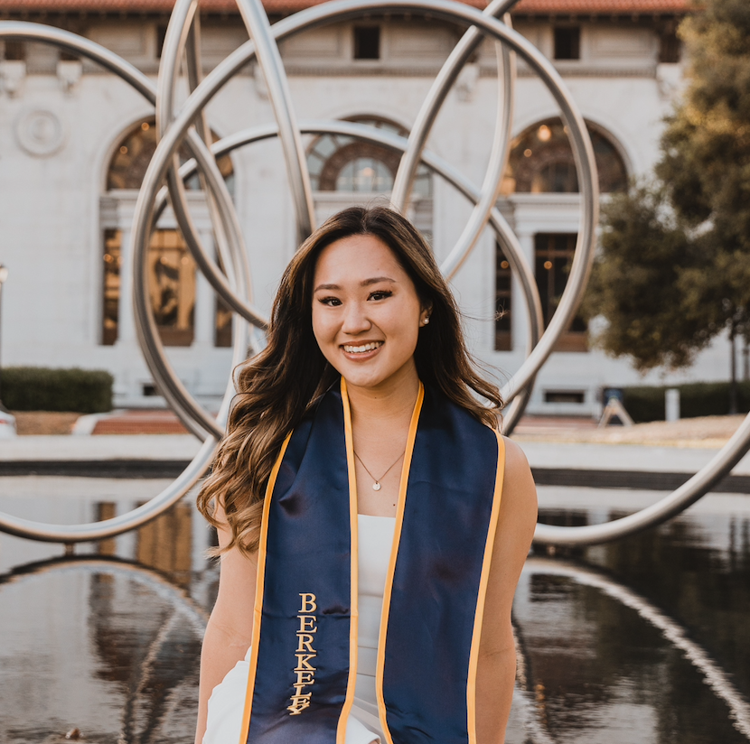

## People | [Home](index.md)

### S. John Liu MD PhD

Chief Resident  
Holman Pathway Research Fellow  
Department of Radiation Oncology  
Department of Neurological Surgery  
University of California, San Francisco  

Dr. John Liu received his bachelor’s degree from Harvard University in Chemical and Physical Biology. He completed his MD and PhD training at the University of California, San Francisco, under joint mentorship with Daniel Lim and Jonathan Weissman. He continued onto residency in Radiation Oncology at UCSF and pursued postdoctoral research with Luke Gilbert, David Raleigh, and Bill Weiss. He currently operates a research program under the directorship of Mitchel Berger within the UCSF Brain Tumor Center, with a research focus on utilizing epigenomic editing for understanding and overcoming treatment resistance in malignant glioma. When not conducting research, John enjoys spending time with his wife and daughter and is frequently seen cycling in the early mornings around the San Francisco Bay Area.

##   

### Joanna Pak

Staff Research Associate

Joanna received her undergraduate degree in health sciences from Chapman University, where she conducted pharmaceutical and cognitive neuroscience research. She is working jointly with the Raleigh and Gilbert labs and is interested in applying cell culture, molecular biology, and CRISPR gene editing approaches for developing new treatments for brain tumors. Outside of lab, Joanna loves needlework, swimming, and crochet. She also has a small collection of wind instruments, which include the recorder Joanna received in 3rd grade (15+ years old and still functional!), a melodica, and her primary instrumental foci, the oboe and English horn. 

##

### Katie Lin

Staff Research Associate

Katie received her undergraduate degree from University of California, Berkeley in Molecular and Cell Biology and Public Health with a minor in Global Public Health. She worked in the Feldman lab at UC Berkeley conducting neuroscience research and also in the Betancur lab at UCSF. Her research focus is developing epigenetic editing tools for silencing drivers of glioblastoma _in vivo_.  
